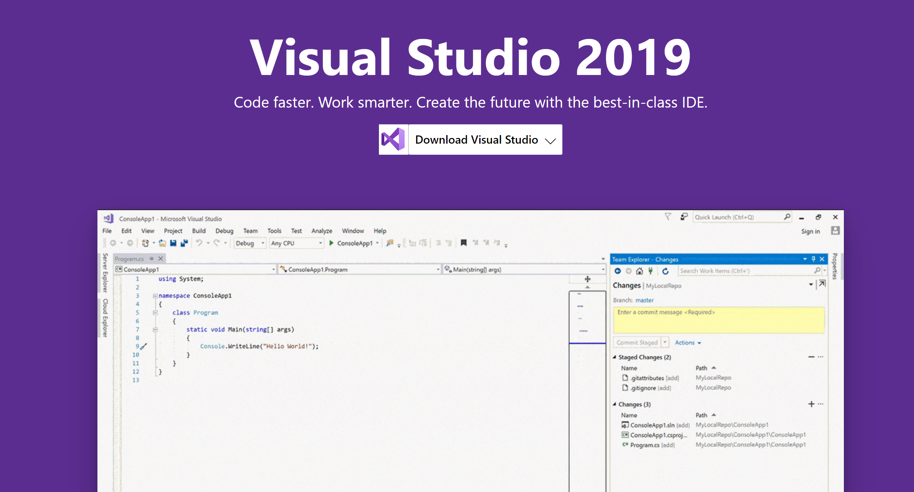
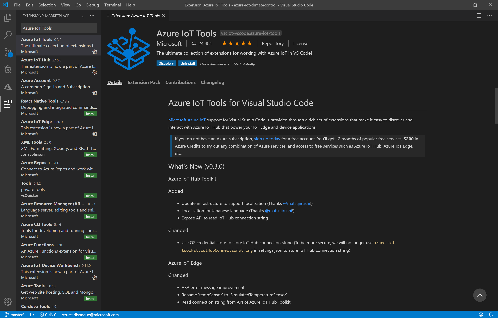
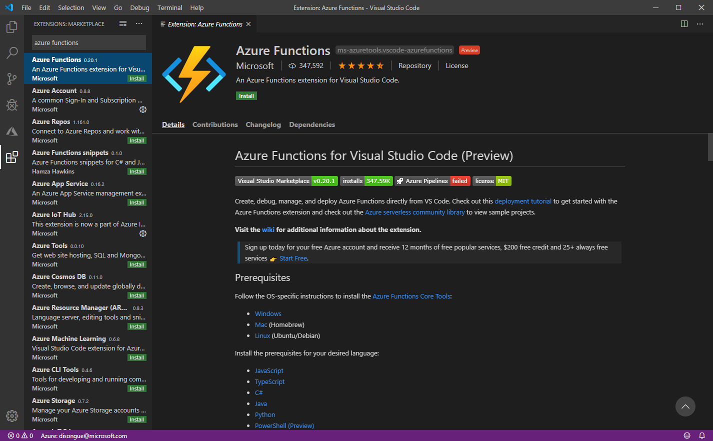
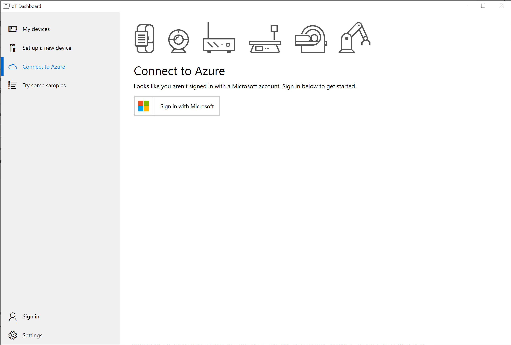

# Prerequisites
With the requirement that beginners with limited prior exposure to hardware or IoT projects can follow this project, a lot of thought went into chosing hardware and software components. On one hand the chosen platform should be able to explain the most important topics like device provisioning, development and rollout, however without hardware specific topics like soldering or circuitry. With software, everything should be doable without prior investments, so the project will focus on freely available tools and subscriptions.


## Hardware used
Since this is an example project, we will focus on a device platform that is cheap, easy to obtain, easy to set up and easy to develop for. The most prominent prototype IoT device platforms are either [Raspberry Pi](https://www.raspberrypi.org/) or [Arduino](https://www.arduino.cc/). The decision is kind of arbitrary since both platforms are well documented and supportted by Azure. For this project we will use a Rasperry Pi.

To further lower the entry barrier, we will use [Grove](https://www.dexterindustries.com/grovepi/) to attach the sensors. Grove is a modular electronic platform ideal for beginners. The Grove board just snaps onto a Raspberry Pi and sensors can be directly plugged into it using a standardized connection cable. This way there is no need for [breadboards](https://en.wikipedia.org/wiki/Breadboard) or soldering.

[](https://www.youtube.com/watch?v=WnOJa4vlS3w)

We also need an SD card to store the operating system on.

Here is the shopping list:

* Raspberry Pi 3 Modell B: https://www.seeedstudio.com/Raspberry-Pi-3-Model-B-p-2625.html
* Seeed Studio Grove Kit for Raspberry Pi: https://www.seeedstudio.com/GrovePi-Starter-Kit-for-Raspberry-Pi-A-B-B-2-3-CE-certifie-p-2572.html
* Any [micro SD card](https://www.raspberrypi.org/documentation/installation/sd-cards.md) from Amazon with at least 16GB of memory

Note that we will also need a way to read and write off this micro SD card from our development PC. So if your PC does not have an SD card slot, also order a USB SD card reader.

To get the most out of this project you can order multiple devices to be able to distribute devices throughout your environment to get multiple readings.

*Beware: When ordering your hardware, make sure to order compatible kits, so that your Grove shield fits and works with your Raspberry version. If in doubt, use the links provided or order an "all in one" package that includes the Raspberry Pi, Grove shield and sensors.*


## Windows for IoT
In the interest of keeping things simple, we will use [Windows for IoT](https://developer.microsoft.com/en-us/windows/iot), specifically [Windows 10 IoT Core](https://docs.microsoft.com/en-us/windows/iot-core/windows-iot-core). This is a version of Windows 10 that is optimized for smaller devices with or without a display that run on both ARM and x86/x64 devices. It also features in-depth documentation around connecting, managing, updating, securing devices, and more.

What's more important: It's very easy to set up, integrate into the Azure IoT platform and to deploy on.

There is no need need to download the Windows installer right now, this will be done when we set up the devices.


## Development Tools: Visual Studio 2019
I used the latest version of [Visual Studio 2019](https://visualstudio.microsoft.com/) to develop the sensor application running on the devices. The [free community edition](https://visualstudio.microsoft.com/de/vs/community/) is perfectly sufficient to do this. Also, all samples should also run with older versions of Visual Studio, for example 2017.

If you are on macOS or Linux, you can also use any kind of editor together with [.NET Core](https://dotnet.microsoft.com/download/dotnet-core/3.1), however I will not go into usage and setup.




## Development Tools: Visual Studio Code
I also used [Visual Studio Code](https://code.visualstudio.com/) for everything Azure related.

It offers an amazing extension to manage IoT Hub instances, devices and functions via the [Azure IoT Tools](https://github.com/Microsoft/vscode-azure-iot-tools) as well as extensions for [Azure Functions](https://github.com/Microsoft/vscode-azurefunctions).

```
File -> Preferences -> Extensions -> "Azure IoT Tools"
```



```
File -> Preferences -> Extensions -> "Azure Functions"
```




## Development Tools: Windows 10 IoT Dashboard
The Windows 10 IoT Dashboard makes flashing Windows 10 IoT Core onto devices simpler with a navigable UI: https://docs.microsoft.com/en-us/windows/iot-core/connect-your-device/IoTDashboard 



---

**Back to the [project README](../README.md).**