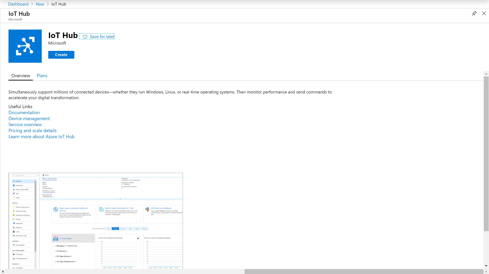
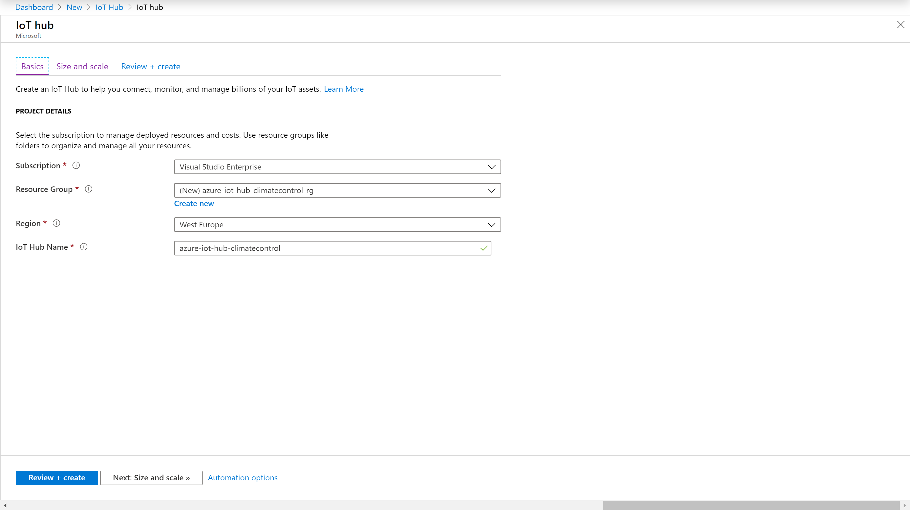
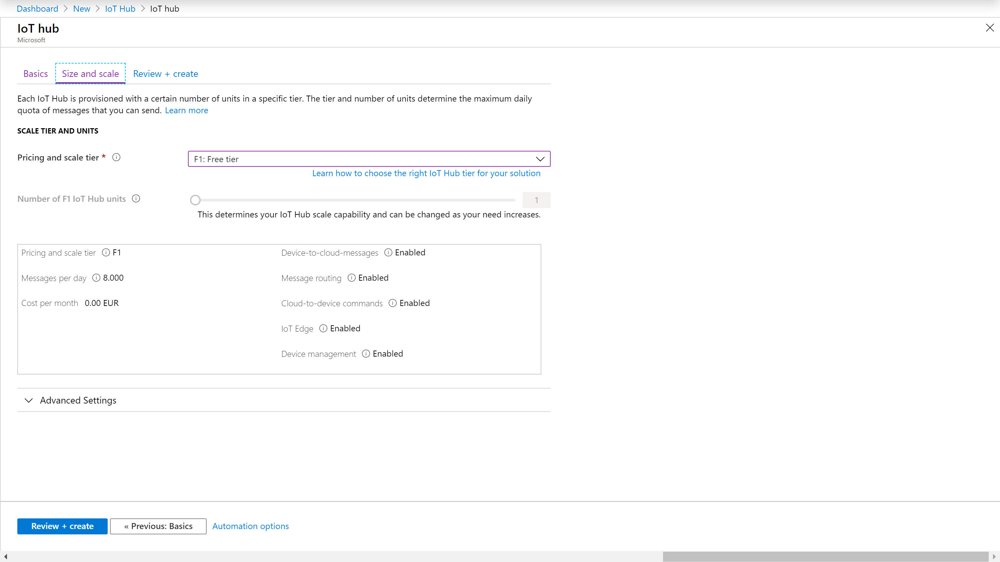
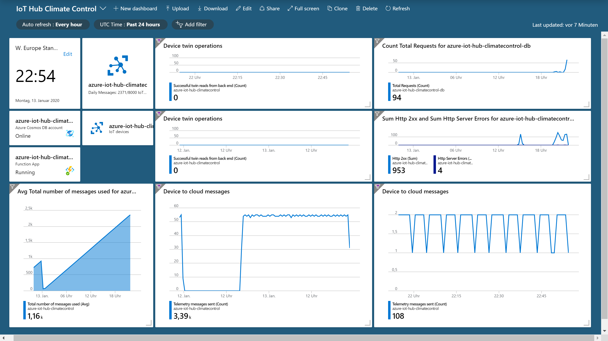

# Azure IoT Hub creation and setup
[Azure IoT Hub](https://azure.microsoft.com/en-us/services/iot-hub/) provides a cloud-hosted solution backend to connect virtually any IoT device. It will take care of device provisioning, authentication, management and communication in a secure and reliable way. You can use Azure IoT Hub to build IoT solutions with reliable and secure communications between millions of IoT devices and a cloud-hosted solution backend.

IoT Hub supports communications both from the device to the cloud and from the cloud to the device. IoT Hub supports multiple messaging patterns such as device-to-cloud telemetry, file upload from devices, and request-reply methods to control your devices from the cloud. IoT Hub monitoring helps you maintain the health of your solution by tracking events such as device creation, device failures, and device connections.

Features of Azure IoT Hub:
* **Security-enhanced communication channel** for sending and receiving data from IoT devices
* **Built-in device management and provisioning** to connect and manage IoT devices at scale
* **Full integration with Event Grid** and serverless compute, simplifying IoT application development
* **Compatibility with Azure IoT Edge** for building hybrid IoT applications

In other words: Azure IoT Hub takes care of the really hard stuff: Securing your devices and and their communication. It also saves you time by providing the nuts and bolts of a good platform like device management and messaging.

## Creating a new Azure IoT Hub instance
Open the [Azure Portal](https://portal.azure.com/). If you do not already have an ccount, please [create one](https://azure.microsoft.com/en-us/free/). The account itself is free and you only pay for cloud services you actually consume. If you already have a Visual Studio Enterprise subscription, you even get [free monthly credits](https://azure.microsoft.com/en-us/offers/ms-azr-0063p/) to use.

In the portal, choose "➕ Create a resource" and search for "IoT Hub".

Select the [subscription](https://azure.microsoft.com/en-us/account/), [resource group](https://docs.microsoft.com/en-us/azure/cloud-adoption-framework/ready/azure-best-practices/naming-and-tagging) and [region](https://azure.microsoft.com/en-us/global-infrastructure/regions/). We also need to give the new Azure IoT Hub a name.

There are multiple pricing tiers for Azure IoT Hub, depending on the number of messages and general scale. For this example project, the free pricing tier is perfectly fine. Review and create the new IoT Hub instance when you are done.

This will initiate the creation of the entire Azure IoT Hub unfrastructure. There are a lot of services attached to the IoT Hub, so it might take a couple of minutes. You will see when it is ready in your notifications (the bell icon in the top right navigation bar).

It also makes sense to create a new [dashboard](https://docs.microsoft.com/en-us/azure/azure-portal/azure-portal-dashboards) that aggregates the most important links and metrics for your IoT Hub. You can add all the created resources as you go along this scenario so that in the end you will have a comprehensible monitoring dashboard.

---

**Back to the [project README](../README.md).**