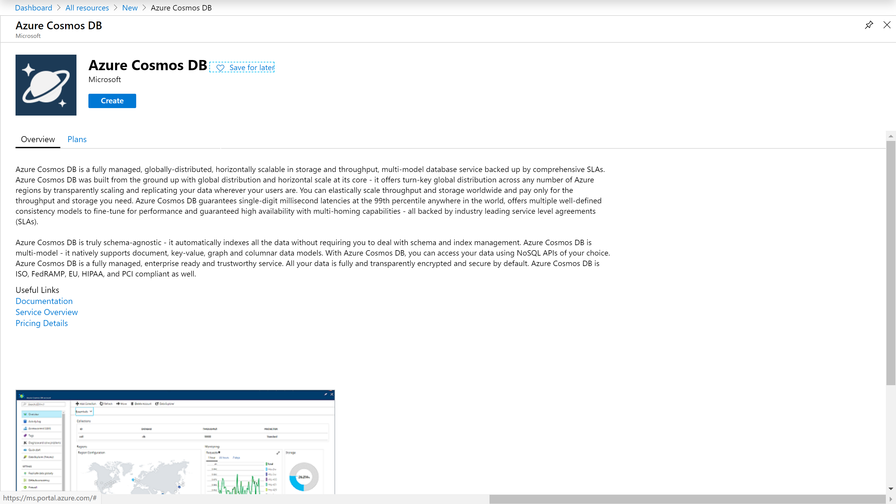
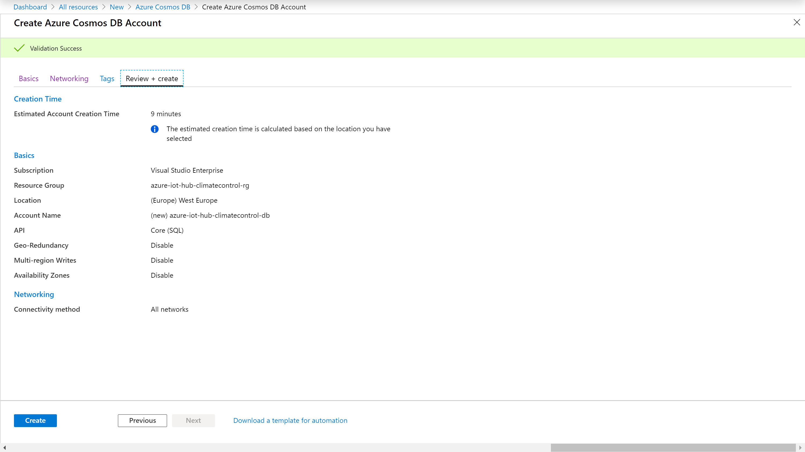
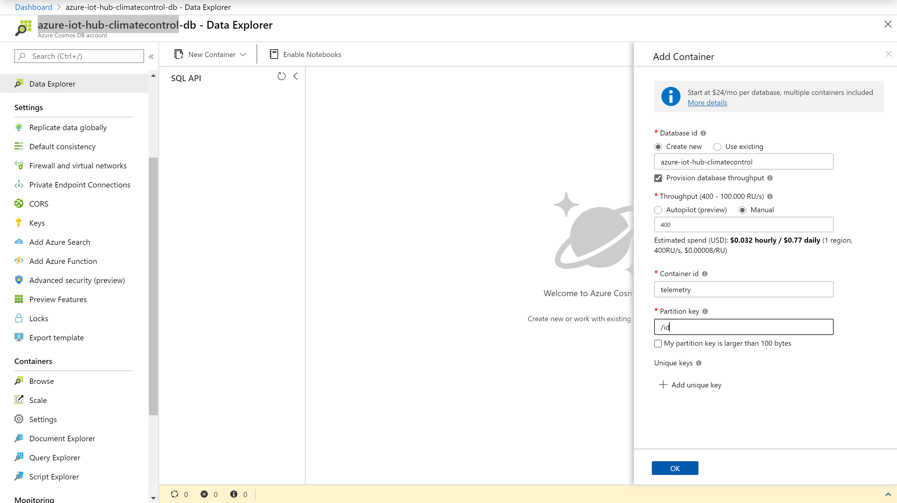

# Database creation and setup
As discussed in the project architecture, the data sent to the Azure IoT Hub should be stored in a database. [Azure Cosmos DB](https://azure.microsoft.com/en-us/services/cosmos-db/) is Microsoft's globally distributed, multi-model database service. You can elastically scale throughput and storage,using your favorite API including SQL, MongoDB, Cassandra, Tables, or Gremlin. That way you can pick whatever engine you are familiar with to manage your data. 

Features of Azure Cosmos DB:
* **Turnkey global distribution** with transparent multi-master replication and five well-defined consistency choices
* **Single-digit millisecond latency** at the 99th percentile and 99.999-percent high availability, for any scale, backed by SLAs
* **Elastic and unlimited scalability** to meet demand with capacity, and payment based on only the throughput and storage you need
* **Multi-model** with wire protocol–compatible API endpoints for Cassandra, MongoDB, SQL, Gremlin, Etcd, and Table along with built-in support for Apache Spark and Jupyter notebooks

*🛑 Be aware: This will be the only Azure service used in this scenario that is not free.* Running the database for a month will cost around 25USD! If you don't want to spend any money, you can leave the entire database aspect out and still follow the rest of the sample.


## Creating a new Azure Cosmos DB instance
Open the [Azure Portal](https://portal.azure.com/), choose "➕ Create a resource" and search for "Cosmos DB".



Please note that for this example I chose a very simple configuration, ignoring some networking that would otherwise be sensible. I also selected an SQL based engine because this is the engine that most will be familiar with (I hope).



To store the actual data, I also create a container within the Cosmos DB instance.

```
Containers -> Browse -> New Container
```

Creating the new container will also create a new database. Note that at this point I am already making some assumptions about the data structure by defining the [container id](https://docs.microsoft.com/en-us/azure/cosmos-db/databases-containers-items) and [partition key](https://docs.microsoft.com/en-us/azure/cosmos-db/partitioning-overview). In this case I just define that each telemetry item has a unique id called "ID" that identifies it. The ID doesn't need to be given by the device, it will be added by the database once a new item is added.



Don't forget to add the database to your [dashboard](https://docs.microsoft.com/en-us/azure/azure-portal/azure-portal-dashboards) to get a quick view what's going on.

---

**Back to the [project README](../README.md).**