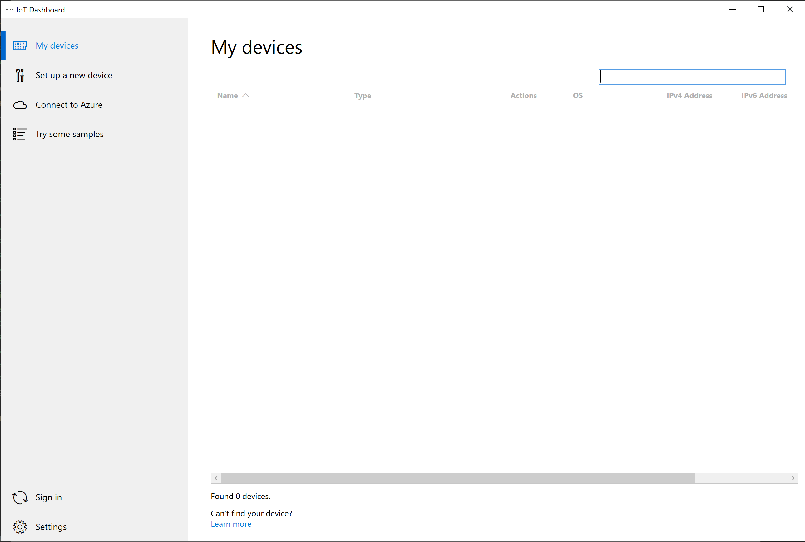
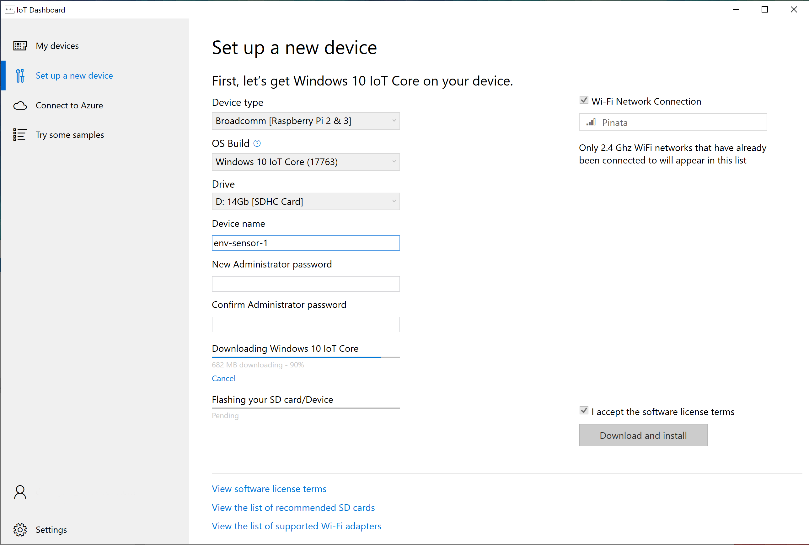

# Device setup
As a reminder, these are the components you need to have to follow the steps:
* Raspberry Pi 3 Modell B: https://www.seeedstudio.com/Raspberry-Pi-3-Model-B-p-2625.html
* Seeed Studio Grove Kit for Raspberry Pi: https://www.seeedstudio.com/GrovePi-Starter-Kit-for-Raspberry-Pi-A-B-B-2-3-CE-certifie-p-2572.html
* Any [micro SD card](https://www.raspberrypi.org/documentation/installation/sd-cards.md) from Amazon with at least 16GB of memory

## Assembling the devices
This is very straight forward and indeed the reason we have chosen this setup: Connect the Grove Pi shield to the Raspberry and then the individual sensors to the Grove Pi shield.

First unpack the Raspberry Pi and the Grove shield, then [attach the Grove shield to the Raspberry Pi](https://www.youtube.com/watch?v=WnOJa4vlS3w) by pushing the shield onto the row of connector pins.

Then check the kit for the [light sensor](http://wiki.seeedstudio.com/Sensor_light/), [sound sensor](http://wiki.seeedstudio.com/Grove-Sound_Sensor/) as well as the [temperature and humidity sensor](http://wiki.seeedstudio.com/Grove-TemperatureAndHumidity_Sensor/). Take three of the provided cables and attach the sensors to the following ports on the Grove shield:

* Light sensor into "A1"
* Sound sensor into "A2"
* Temperature and humidity sensor into "D4"

*Note: This is the default configuration of the device application. If you want to change the ports, you can do so in the [app source code](6-device-application.md).*

You can leave the micro SD card as this will be set it up in the next step.

## Installing the Operating System
If you have not done so already, please download the Windows 10 IoT Core Dashboard: https://developer.microsoft.com/en-us/windows/iot/downloads now.

First you need to log into your Azure account. Click on "Connect to Azure" and enter the Microsoft ID you used to create the Azure IoT Hub.

Insert the SD card you want to use for your device into your PC and select "Set up a new device".

The device type is "Broadcomm [Raspberry Pi 2 & 3]". Note that Windows IoT Core cares more about the chipset on the prototype board than the boards themselves. The OS should come with all the drivers you need regarding connectivity and even display, sound etc.

Next, select the OS Build you want to use. Usually the latest is fine and there is no need to go with Insider Preview builds, except you want some specific preview abilities.

*Note: If you bought a Raspberry 3B+ (plus) instead of a 3B, then you need to download and install another image manually from [here](https://www.microsoft.com/en-us/software-download/windowsiot) -> RaspberryPi 3B+ Technical Preview Build 17661.*

Make sure you select the drive that is assigned to the micro SD card. This is the drive that will be flashed with Windows 10 IoT Core.

Give your future IoT device a name and an administrator password. Whatever you enter as password will be the login for the device portal and other forms of access. The user is always "Administrator".

To the right you can set the Wi-Fi connection from the list of local networks known to your PC. After booting up the Raspberry will automatically connect to the selected Wi-Fi network.

Confirm the license terms and click on "Download and install". This will first download the OS and then install it onto the SD card. You might have to confirm the installation during the process.

After the process is finished, take out your SD card, put it into your Raspberry Pi and boot it up by connecting the power cord. For the first boot process it makes sense to attach a monitor to your Raspberry Pi to make sure everything is fine. Note that the device might boot a number of times until ready. You might also need to go through the initial configuration process.

If the device booted up correctly and is on the network, it will turn up in "My devices" in the IoT Dashboard with the name you defined.

---

**Back to the [project README](../README.md).**