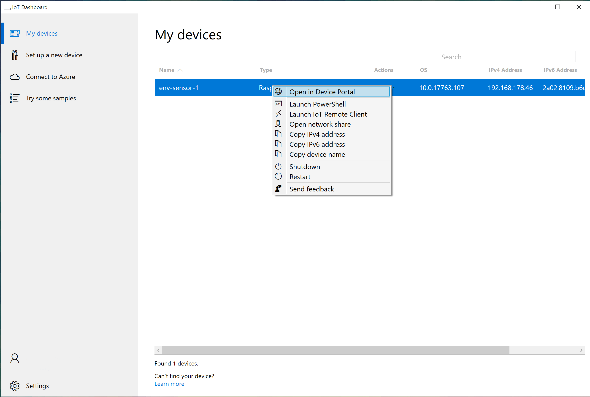
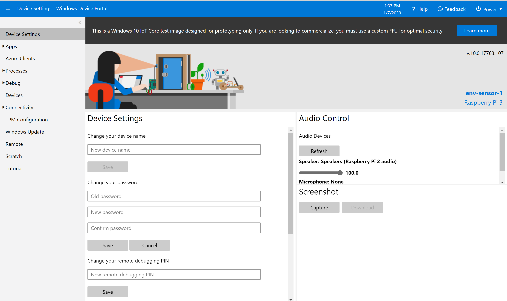
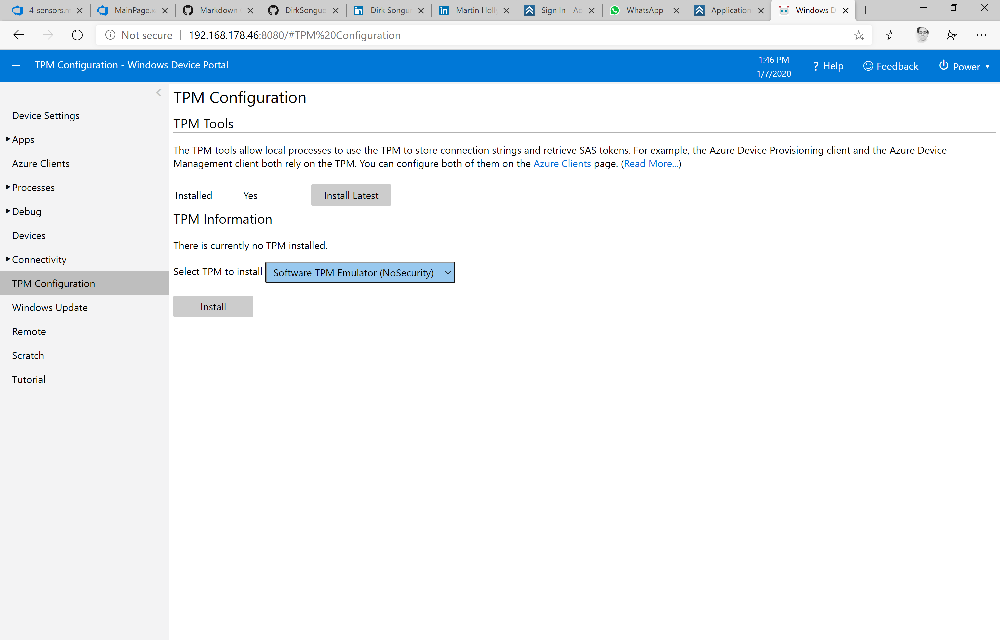
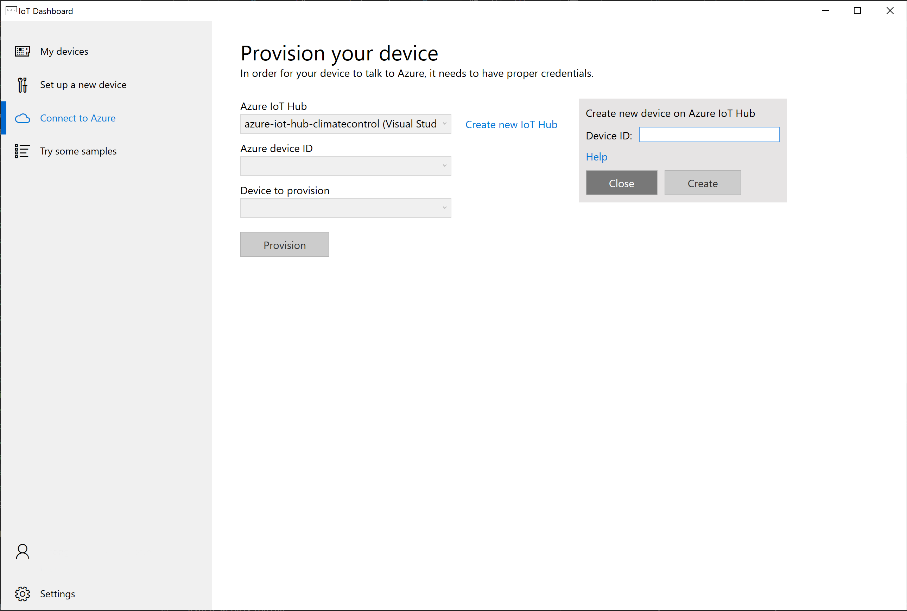
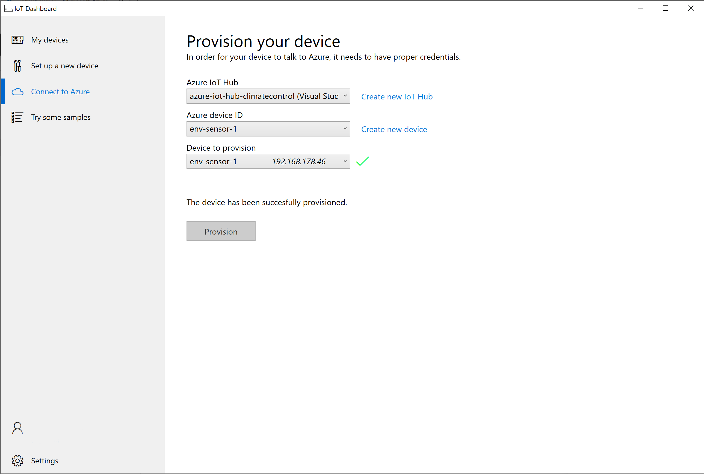
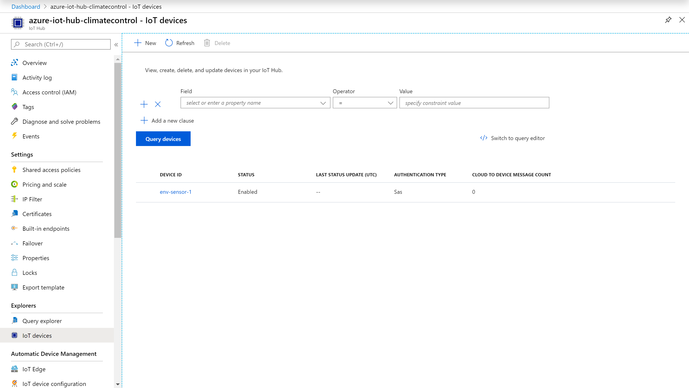

# Connecting the device to Azure IoT Hub
Microsoft publishes open-source device SDKs on GitHub to help connect devices to Azure IoT Hub and the Device Provisioning Service. The device SDKs are available for C, .NET (C#), Java, Node.js, and Python. There is also a [catalog](https://catalog.azureiotsolutions.com/) of Azure certified devices you can connect to Azure IoT.

These devices and the apps they run send telemetry to your IoT Hub, and optionally receive messages, job, method, or twin updates from the IoT Hub.

In terms of registering individual devices for a specific Azure IoT Hub infrastructure, the IoT Hub Device Provisioning Service is a helper service that enables zero-touch, just-in-time provisioning to the right IoT hub without requiring human intervention, enabling customers to provision millions of devices in a secure and scalable manner.

There are many provisioning scenarios in which the Device Provisioning Service is an excellent choice for getting devices connected and configured to IoT Hub, such as:

* **Zero-touch provisioning** to a single IoT solution without hardcoding IoT Hub connection information at the factory (initial setup)
* **Load balancing** devices across multiple hubs
* Connecting devices to their **owner’s IoT solution** based on sales transaction data (multitenancy)
* Connecting devices to a **particular IoT solution** depending on use-case (solution isolation)
* Connecting a device to the IoT hub with the **lowest latency** (geo-sharding)
* **Reprovisioning** based on a change in the device
* **Rolling the keys** used by the device to connect to IoT Hub (when not using X.509 certificates to connect)

While the Raspberry Pi is [Azure certified](https://catalog.azureiotsolutions.com/details?title=Raspberry_Pi3), it does not have dedicated TPM hardware, which is required for provisioning. Luckily Windows 10 IoT offers TPM software emulation, however this needs to be installed and configured first.

## Installing TPM Tools
In the IoT Dashboard, select "My devices". Check on the IoT device you just set up, click on "..." and select "Open in Device Portal. This will launch a browser into the web based backend of your Raspberry Pi.

Enter "Administrator" as user and the password defined during the installation process. This will bring you into the device settings of your device.

From the left menu select "TPM Configuration" and install the latest TPM tools. When done, select "Software TPM Emulator" and install. After that the device can be provisioned.

## Connecting the device to the Azure IoT Hub
Switch back to the IoT Dashboard and select "Connect to Azure" to start the provisioning process.

Choose the [Azure IoT Hub instance you have created earlier](2-setting-up-azure-iot-hub.md) from the dropdown.

Then select "Create a new device". This will create a new device within your Azure IoT Hub. While you could do the same in the Azure Portal, the IoT Dashboard takes care of a lot of steps in the background. The name of the new device should mirror the device name chosen when installing the OS.

After the creation, select the new device and provision it. From the dropdown select the name of the device you created earlier. For this to work you ned to have installed the TPM Tools (as shown above) and completed a reboot of the device. Enter the username (Administrator) and password (the one you defined during setup) to allow the IoT Dashboard access to the device.

With that, your device should be connected to the Azure IoT Hub. Switch to the [Azure Portal](https://portal.azure.com/), select your Azure IoT Hub and the "IoT devices" option. In the list, you should be able to see the device you created and provisioned. You can click on it for more information.

*Optional: To further validate that your device is properly connected to your Azure IoT Hub, you can run an official sample app. Follow the steps provided [here](https://github.com/Microsoft/Windows-iotcore-samples/tree/develop/Samples/Azure/IoTHubClients#deploy-the-pre-built-sample-client-application-to-the-device).*

---

**Back to the [project README](../README.md).**