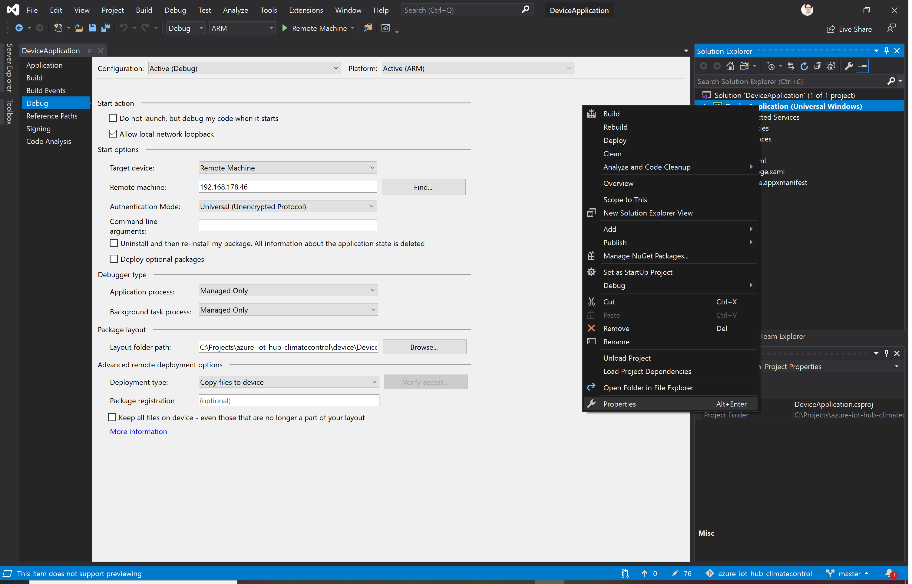
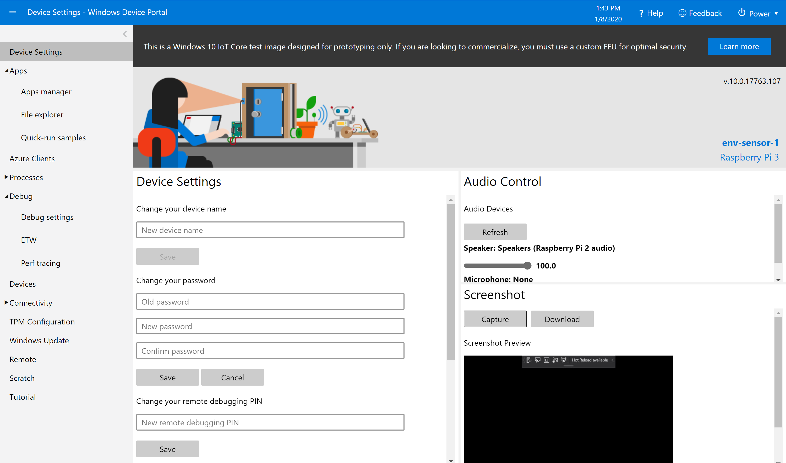
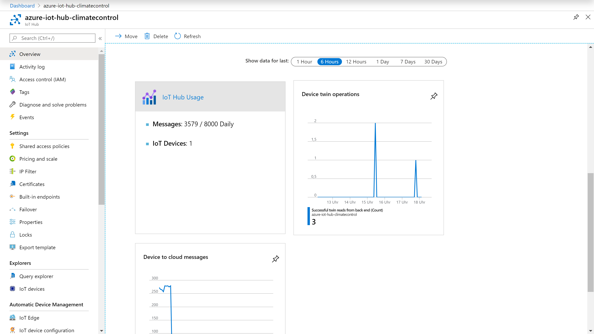
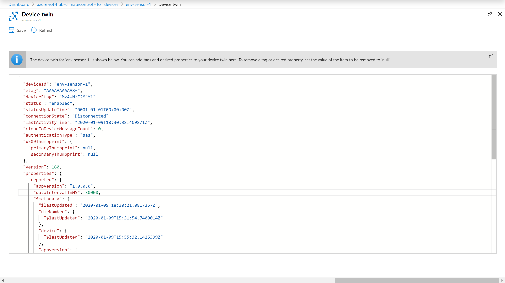
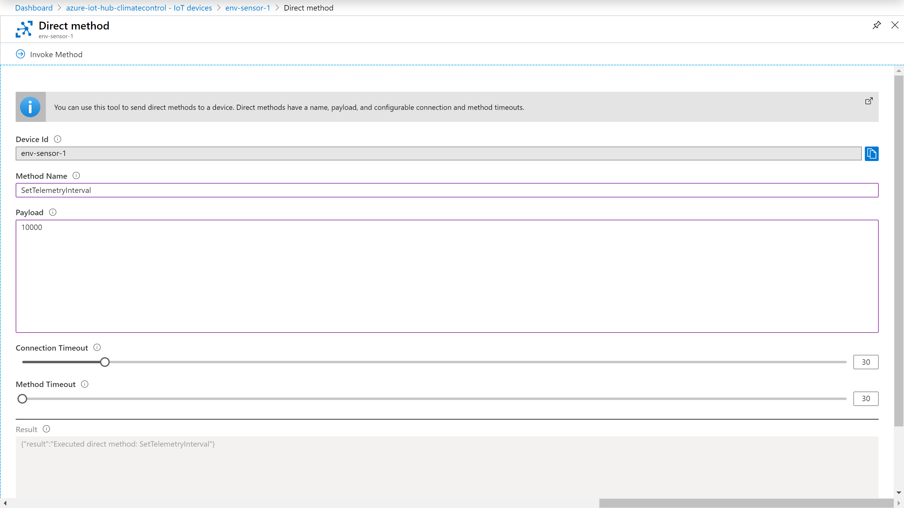
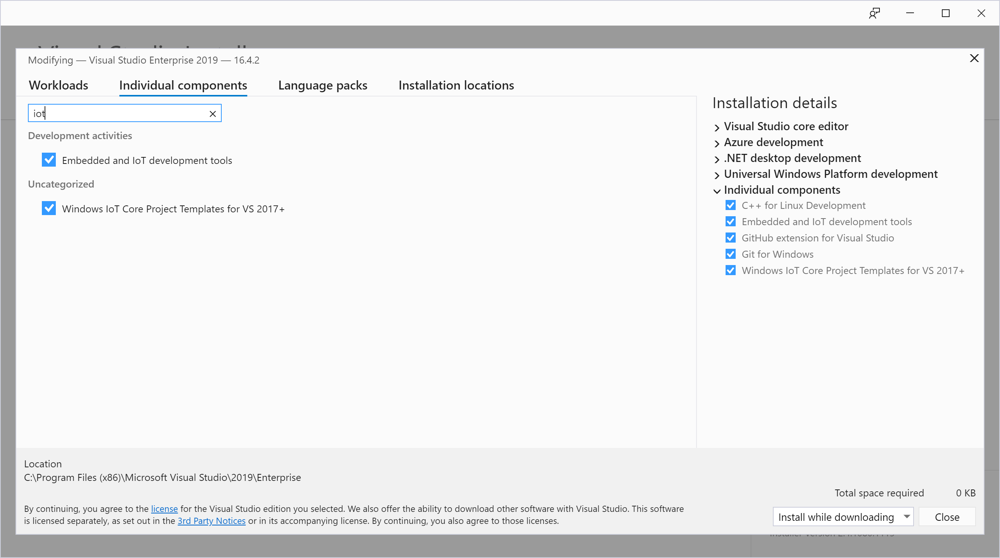
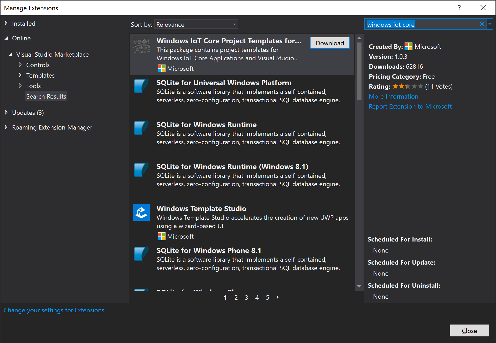
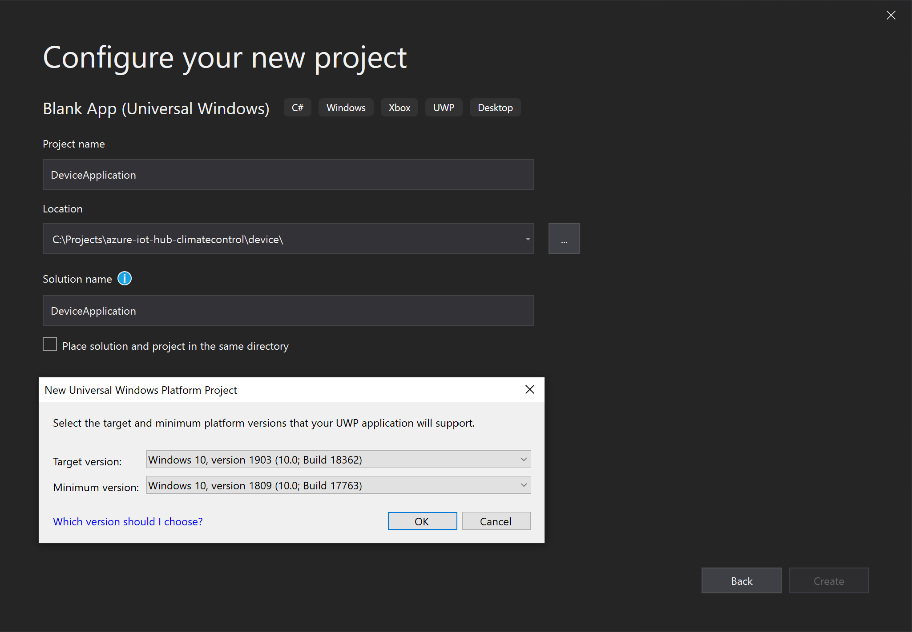
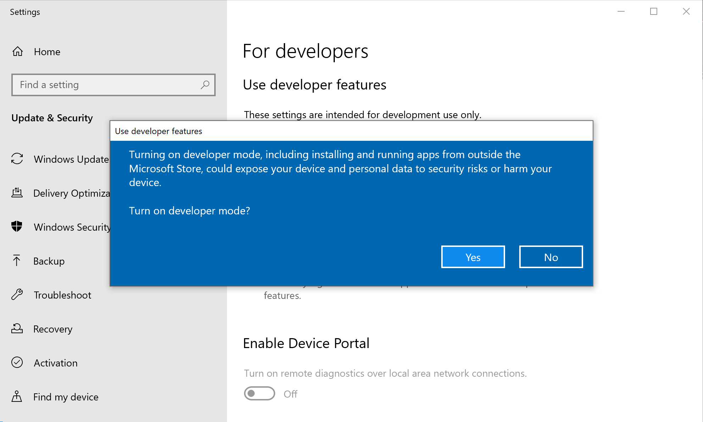
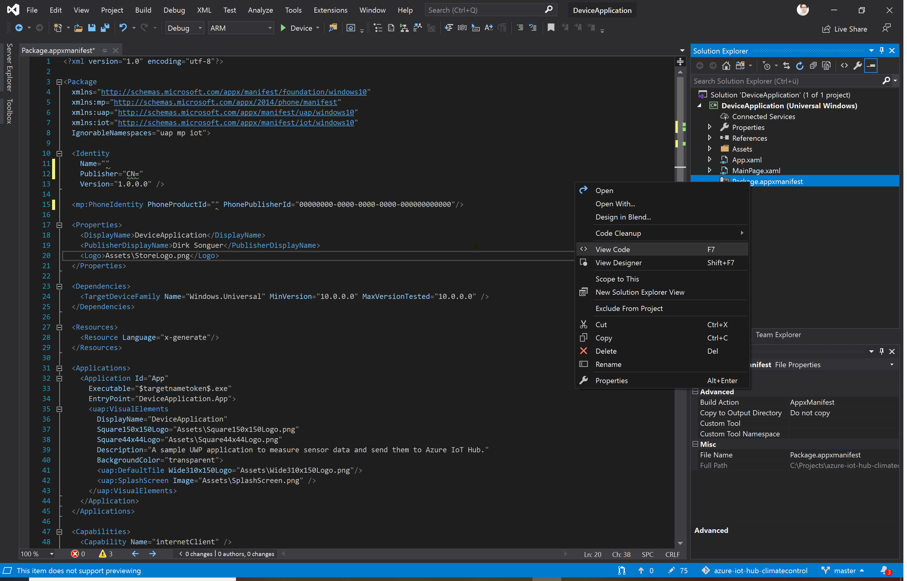

# Running the device application
There are two options how to run the application on your device: Download a release package or compile it yourself from the provided source code.


## Option 1: Downloading and sideloading the application
Download a release of the device application from the [release page on Github](https://github.com/DirkSonguer/azure-iot-hub-climatecontrol/releases).

Install the application on your IoT device as [described in the documentation](https://docs.microsoft.com/en-us/windows/iot-core/develop-your-app/appinstaller).


## Option 2: Compiling and deploying the device application
As [described](1-prerequisites.md) I used the latest version of [Visual Studio 2019](https://visualstudio.microsoft.com/). If you are on macOS or Linux, you can also use any kind of editor together with [.NET Core](https://dotnet.microsoft.com/download/dotnet-core/3.1), however I will not go into usage and setup.

To run the application on the device, open the solution */device/DeviceApplication.sln* in Visual Studio.

Right click on the project in the Solution Explorer and select "Properties" and make sure the "Remote Machine target device" is set to the IP of your IoT device you want to install the application on. The target architecture should match the one of your device, in our case "ARM".



Compile and run on the remote machine to push the application onto the device. To validate that the app is running, you can either attach a monitor to the IoT device or you can open the Device Portal and capture a screenshot.




## What the application does
Once the application runs, it will try to send ân initial update of the Device Twin data to the Azure IoT Hub as well as a telemetry update every 30 seconds.

*Note that the connection will only be successful if the device was [provisioned correctly](5-device-provisioning.md).*

Once the application is running you should see activity in the Azure IoT Hub. Go to the [Azure Portal](https://portal.azure.com/), select your IoT Hub instance and scroll down on the overview blade:



Once the connection is established the application will also expose its configuration in the Device Twin information. In the Azure Portal, select the respective device and click on "Device Twin". Note that the application [reported](https://docs.microsoft.com/en-us/azure/iot-hub/iot-hub-devguide-device-twins) the version number as well as the current data update interval.



The application sends [telemetry data](https://docs.microsoft.com/en-us/azure/iot-hub/iot-hub-devguide-messages-d2c) to the IoT Hub, which can be handled as an event, for example an [Azure function](7-azure-functions.md). We will set this up in the next step.

The application is further able to react to [messages](https://docs.microsoft.com/en-us/azure/iot-hub/iot-hub-devguide-direct-methods) from the Azure IoT Hub. In the Azure Portal, select the respective device and click on "Direct Method". The method name is "SetTelemetryInterval" and the payload should be the new interval for telemetry updates in milliseconds. It should be between 5000ms and 60000ms, other values will be ignored. Make sure to set a sensible connection and method timeout, depending on the network connection your IoT device is on.

If successful, the method will return a confirmation. Once confirmed, the application will send the telemetry data in the new interval and also change the device twin information to reflect the change.



You can check exactly what the application does in the [source code](https://github.com/DirkSonguer/azure-iot-hub-climatecontrol/blob/master/device/DeviceApplication/). Note that the application architecture and code is not necessarily the most efficient - it's optimized for readability and to be easy to follow.


## Developing an IoT application from scratch
To re-create the project from scratch, make sure you have installed the "Embedded and IoT development tools" workload in the Visual Studio Installer.



Also, add the Windows IoT Core Project Templates:

```
Extensions -> Manage Extensions -> "Windows IoT Core"
```



Those are needed to create [background applications](https://docs.microsoft.com/en-us/windows/iot-core/develop-your-app/backgroundapplications) for Windows 19 IoT. These are applications that have no direct UI, which are launched at machine startup and run continuously. If they crash or exit the system will automatically restart them.

The included app is a [foreground application](https://docs.microsoft.com/en-us/windows/iot-core/develop-your-app/buildingappsforiotcore), which is basically just a standard UWP application with the Windows 10 IoT extensions added.

When creating the application, make sure that at least the minimum version of the SDK matches the OS installed on the IoT device.



If you haven't done so already, activate developer mode in the settings of your PC.



When using a standard UWP application, the "iot" namespace needs to be added to the manifest. Right click on the "Package.appxmanifest" file in the Solution Explorer and select "View Code".



Inside the package attribute of the manifest, you need to define the iot xmlns as well as add it to the IgnorableNamespaces list. The final manifest file should start like this:

```xml
<Package
  xmlns="http://schemas.microsoft.com/appx/manifest/foundation/windows10"
  xmlns:mp="http://schemas.microsoft.com/appx/2014/phone/manifest"
  xmlns:uap="http://schemas.microsoft.com/appx/manifest/uap/windows10"
  xmlns:iot="http://schemas.microsoft.com/appx/manifest/iot/windows10"
  IgnorableNamespaces="uap mp iot">
```

Also add two more capabilities to the appxmanifest, which are needed to read the TPM information from a provisioned device. Scroll to the bottom and extend the capabilities with this:

```xml
  <Capabilities>
    <Capability Name="internetClient" />
    <iot:Capability Name="systemManagement"/>
    <iot:Capability Name="lowLevelDevices"/>
  </Capabilities>
```

Next, chose "Remote Machine" as the target instead of "Device". The dialog should show the IoT device if it's in the same network. If you encounter issues, right click on the project in the Solution Explorer and select "Properties". Make sure the remote machine is set to the IP of your IoT device.

Also, the target architecture should match the one of your device. For Raspberry Pi this is "ARM".


At this point you can already compile the empty template and deploy it to the remote device. Once finished, you can verify that the app is indeed running by capturing a screenshot in the Device Portal for your device.


Now you can expand the application with your own code.

---

**Back to the [project README](../README.md).**