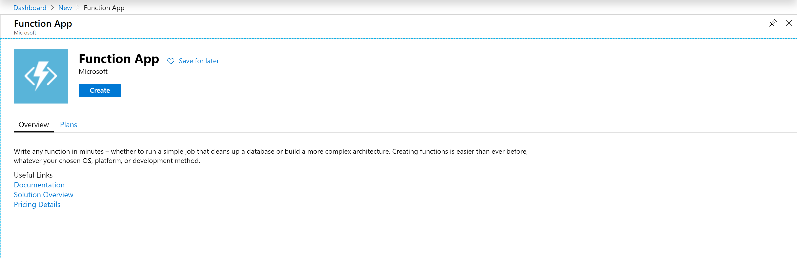
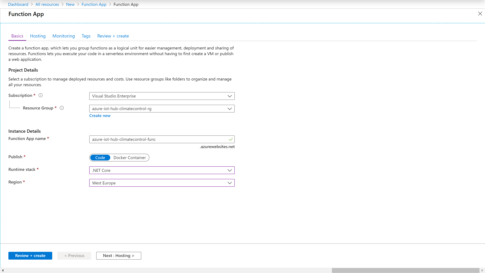
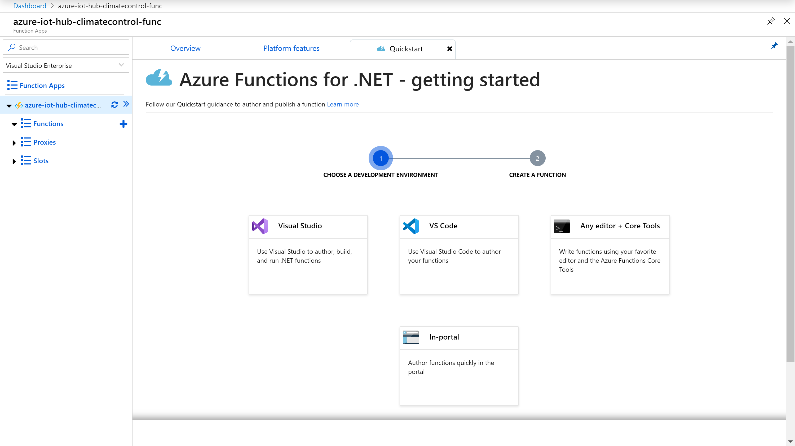
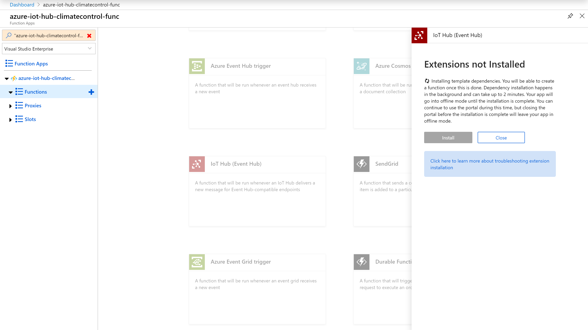
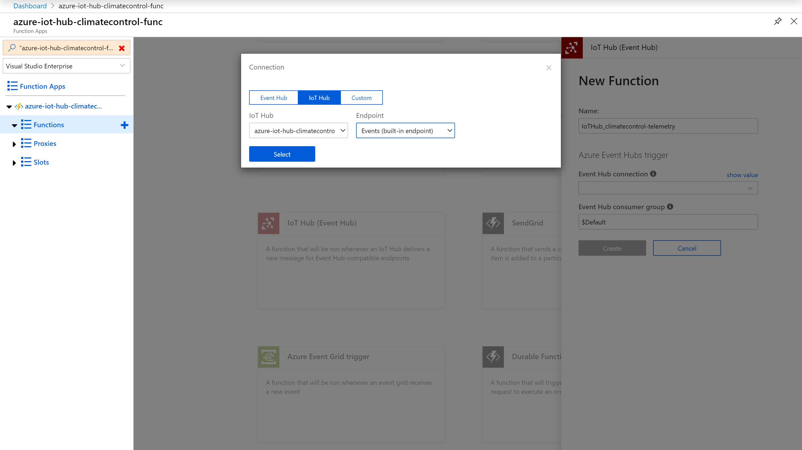
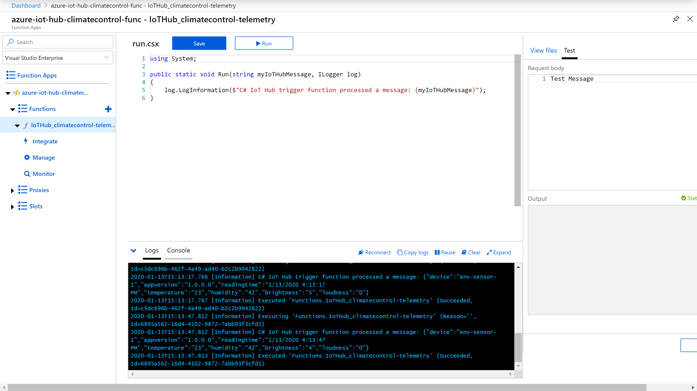
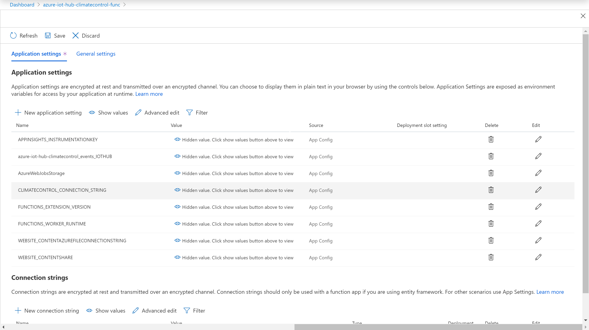
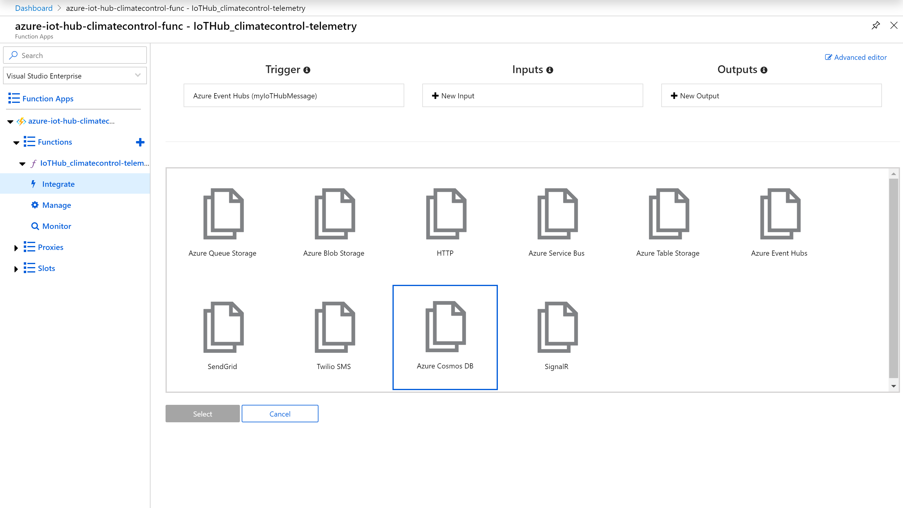
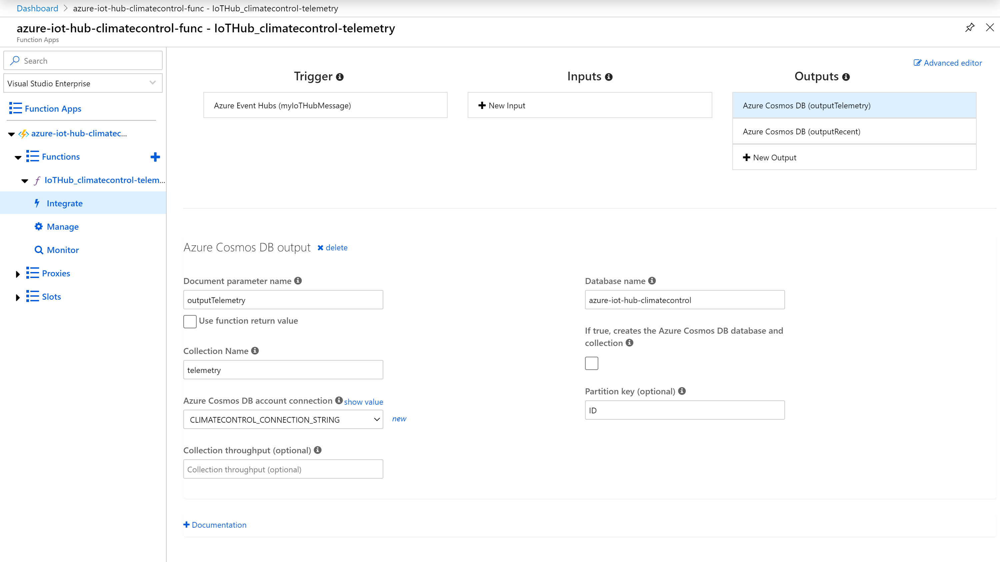

# Adding Azure Functions
Earlier we created the Azure IoT Hub and created an application running on an IoT device that sends regular telemetry updates to the Hub. While the Hub is receiving this telemetry data, it's not doing anything with it yet. We now create a function that will take the telemetry data and store it into the database.

For that, we will use [Azure Functions](https://azure.microsoft.com/en-us/services/functions/). This is a solution for easily running small pieces of code, or "functions," in the cloud. You can write just the code you need for the problem at hand, without worrying about a whole application or the infrastructure to run it.You can use your development language of choice, such as C#, Java, JavaScript, PowerShell, and Python.

Features of Azure Functions:
* **Automated and flexible scaling** based on your workload volume, keeping the focus on adding value instead of managing infrastructure
* **Integrated programming model** based on triggers and bindings that help you respond to events and seamlessly connect to other services
* **End-to-end development experience**, from building and debugging to deploying and monitoring with integrated tools and built-in DevOps capabilities
* **Variety of programming languages** and hosting options—always pick the best one for each scenario and quickly adjust to meet business needs

Note that technically there are even easier ways of handling telemetry data sent to an Azure IoT Hub, using UI based routing without any coding, however in the interest of creating an example that can be expanded on later, we will use a programmatic approach.


## Creating a new Azure Function
Open the [Azure Portal](https://portal.azure.com/), choose "➕ Create a resource" and search for "Function App".



As usual select the [subscription](https://azure.microsoft.com/en-us/account/), [resource group](https://docs.microsoft.com/en-us/azure/cloud-adoption-framework/ready/azure-best-practices/naming-and-tagging) and [region](https://azure.microsoft.com/en-us/global-infrastructure/regions/). Also, give your new function a sensible name.

I selected an Azure function based on .NET Core, so the application code will be in C#. Since the device code is in C# as well,  assume that this is a technology most of you will be familiar with. However feel free to chose any other language you are familiar with.



In the interest of simplicity, we keep everything else on default: New storage account, consumption based plan, active Application Insights and no tags. Wait until the deployment of the new Azure Function is complete, then select it.

Create a new function within your function app by either clicking on the quickstart tab, the "➕ New function" button or the "➕" icon next to the "Functions" list. In either case you will be asked to chose your IDE. This is basically personal preference. As said in the [prerequisites](1-prerequisites.md), [Visual Studio Code](https://code.visualstudio.com/) works very well, but you could even develop the function directly in the browser.



When asked which type of function to create, select "More templates.." and create the function. In the list of available templates, scroll down to the "IoT Hub (Event Hub)" template. Then install any extension required (assuming you haven't installed them already).



Give your function a sensible name. Then we connect it to the IoT Hub events - select "New" and switch to "IoT Hub" as the connection (instead of "Event Hub"). From the dropdown select the Azure IoT Hub instance created earlier.



Then create the function and wait for the deployment to be finished.

**Note that if you left your application running on the device, you will immediately see the telemetry data messages in the logs output.**




## Adding a new output
We defined the Azure IoT Hub as input, so any message it receives gets routed to our function. We now define the Cosmos DB we created earlier as an output.

Technically we could add all output code programatically: The database connection, selecting the collection and then writing to it. However it is way easier to just use a function output.

First, we need to add the credentials for the database, so the output can use it. Select the overall function (for example "azure-iot-hub-climatecontrol-func") and click on "Configuration" to add the database connection string as an application setting.

**Note: The connection string can be found in the "Keys" blade of your Cosmos DB.**

Name the setting CLIMATECONTROL_CONNECTION_STRING and paste the connection string as its value. Scroll up and click "save".



Now select the Azure Function and click on "⚡ Integrate". On the top right, click on "➕ New Output".

From the list, select "Azure Cosmos DB" as the new output.



The "Document parameter name" will be the *out* parameter in your function code. Whatever you write to this object will be then passed to the Cosmos DB.

Enter the correct database and collection name your have created your database with.

For the "Azure Cosmos DB account connection", select the application setting you have created earlier. Then save.




## Adding the function code
The created Azure Function will have 2 files:

* **functions.json** contains the configuration data to connect your function to the event manager of the IoT Hub as well as the Cosmos DB.
* **run.csx** contains the actual code that is executed every time a telemetry message is received by the Hub's event manager.

Replace the run.csx contents with the one found in /azurefunctions.

Start the application on the device (if you have not already done so) and check that the data is coming in. Make sure the function completes successfully in the log. If it does, the data should now show up in the database.

You can also use the following data for testing:

```
{"device":"test-sensor-1","appversion":"1.0.0.0","readingtime":"1/13/2020 10:03:26 PM","temperature":"24","humidity":"42","brightness":"22","loudness":"10"}
```

Using "test-" as device name will help you filter out your test queries from the database later.

---

**Back to the [project README](../README.md).**